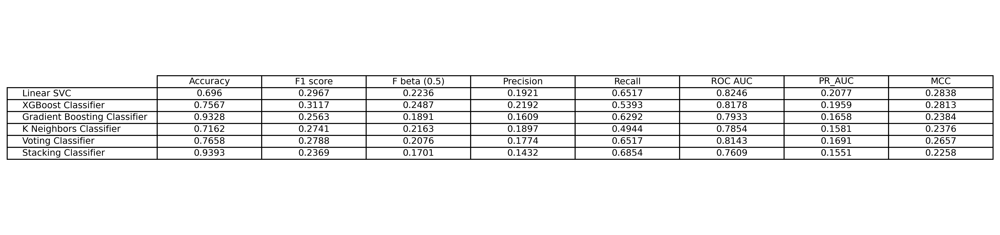

# Stroke Prediction using ML techniques

This project explores various machine learning approaches to predict the risk of stroke occurence from healthcare data. The data used to train the models is from [Kaggle](https://www.kaggle.com/datasets/fedesoriano/stroke-prediction-dataset/data).

**Note : This dataset is heavily imbalanced and contains only a few cases of positives (Stroke occured) and as a result, models tend to prefer predicting the negative class.**

To address the class imbalance, different oversampling techniques paired with multiple classification algorithms have been used, along with hyperparameter tuning.

### Installation instructions

Open a terminal/command line in your desired folder and run these commands :

```
git clone https://github.com/sreerag03a/stroke-prediction.git
cd stroke-prediction
pip install -r requirements.txt

```

Now, to just get the flask app running, it is recommended to run project_stage.py

```
python project_stage.py

```

This automatically downloads the data and trains all the models (Note that this takes quite a long time because of the many combinations of oversamplers,models and hyperparameters)

### Models and Oversamplers

#### Oversampling methods

1. SMOTE
2. ADASYN

#### Models

1. Linear Support Vector Machine
2. XGBoost Classifier
3. Gradient Boosting Classifier
4. K Neighbors Classifier
5. Logistic Regression (within Voting and Stacking Classifiers)
6. Random Forest Classifier (within Voting and Stacking Classifiers)
7. Support Vector Machine (within Voting and Stacking Classifiers)

### Evaluation Metrics

- Accuracy
- Recall
- Precision
- $F_1$ Score
- $F_\beta$ Score
- ROC AUC
- PR AUC
- Matthews Correlation Coefficient (MCC) - Also called the Phi ($\phi$) coefficient

### Model Performance


